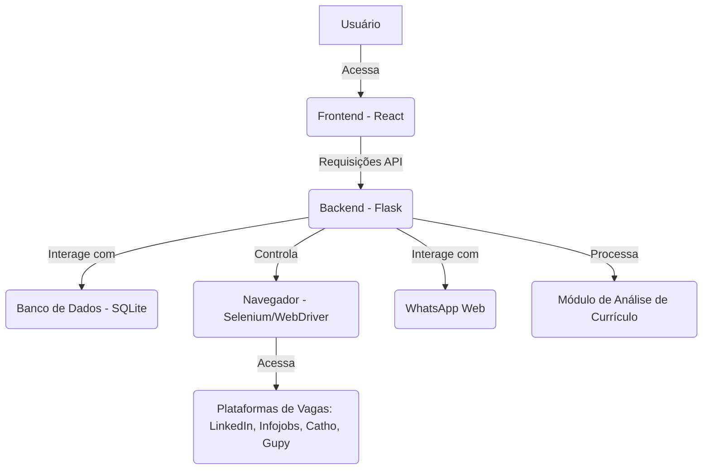

## Tarefas da Automação de Vagas

### Fase 1: Análise e planejamento da arquitetura do sistema
- [ ] Detalhar os requisitos de cada funcionalidade (busca, inscrição, WhatsApp, análise de currículo).
- [ ] Definir a estrutura de dados para armazenar informações de vagas e inscrições.
- [ ] Escolher as bibliotecas e ferramentas para web scraping e automação de navegador.
- [ ] Esboçar a arquitetura geral do sistema (backend, frontend, comunicação).

### Fase 2: Desenvolvimento do backend Flask com automação de vagas
- [ ] Configurar o ambiente Flask.
- [ ] Implementar a autenticação nas plataformas (LinkedIn, Infojobs, Catho, Gupy).
- [ ] Desenvolver módulos de busca de vagas para cada plataforma.
- [ ] Implementar a lógica de inscrição em vagas (candidatura simplificada, upload de currículo).
- [ ] Adicionar filtros de salário, região, tipo de vaga, PCD, ensino superior, inglês, modalidade.
- [ ] Armazenar resultados das inscrições e vagas encontradas.

### Fase 3: Criação da interface frontend com tema escuro
- [x] Configurar o ambiente React.
- [x] Desenvolver a interface de usuário com tema escuro.
- [x] Criar formulários para entrada de critérios de busca e credenciais.
- [x] Exibir barra de progresso e terminal de execução.
- [x] Apresentar resultados das inscrições de forma clara.

### Fase 4: Implementação da funcionalidade de análise de currículo
- [x] Desenvolver módulo para upload e leitura de currículo.
- [x] Implementar lógica de análise de currículo para adequação às vagas.
- [x] Gerar nota de avaliação e sugestões de melhoria.

### Fase 5: Integração e testes do sistema completo
- [x] Integrar frontend e backend.
- [x] Realizar testes unitários e de integração.
- [x] Testar a automação de ponta a ponta em todas as plataformas.
- [x] Refinar a experiência do usuário e corrigir bugs.

### Fase 6: Deploy e entrega do sistema ao usuário
- [x] Preparar o ambiente para deploy.
- [x] Realizar o deploy do backend e frontend.
- [x] Fornecer instruções de uso e acesso ao usuário.
- [x] Entregar o resultado final ao usuário.

### Detalhamento dos Requisitos (Fase 1)

#### Busca e Inscrição de Vagas:
- **Plataformas:** LinkedIn (candidatura simplificada), Infojobs, Catho, Gupy.
- **Credenciais:** Gerenciamento seguro das credenciais fornecidas.
- **Filtros:**
  - **Tipo de Vaga:** Analista financeiro, Contas a pagar, Contas a receber, Analista de precificação, Custos.
  - **Salário:** Acima de R$1900,00 (padrão).
  - **Região:** São Paulo.
  - **PCD:** Não PCD.
  - **Ensino Superior:** Com ou sem exigência.
  - **Inglês:** Com ou sem exigência.
  - **Modalidade:** Híbrido, Presencial, Remoto.
- **Currículo:** Opção de selecionar/carregar o último currículo.
- **Resultados:** Relatório de vagas inscritas por plataforma e total, com indicação de vagas para segunda fase.

#### Contato via WhatsApp:
- **Funcionalidade:** Buscar números de telefone/WhatsApp de empresas/RH de vagas inscritas.
- **Integração:** Acionar WhatsApp Web com script padrão.
- **Scripts:**
  - **Empresa:** Solicitando melhor número de contato e responsável pelo RH.
  - **RH/Recrutadora:** Apresentando-se para a vaga.
- **Controle:** Intervalos de acionamento (máx. 11 a cada 10min), evitar spam (identificar números/empresas já acionados nos últimos 30 dias).

#### Análise de Currículo:
- **Funcionalidade:** Analisar currículo para adequação às vagas de Analista financeiro, Contas a pagar, Contas a receber, Analista de precificação, Custos.
- **Saída:** Nota de avaliação (0-5 estrelas) para cada área e sugestões de melhoria.

#### Interface Frontend:
- **Design:** Tema escuro, bem estruturado.
- **Feedback:** Terminal mostrando momentos de execução e barra de progresso.
- **Título:** Um título criativo para o programa.

#### Backend:
- **Tecnologia:** Flask (sugerido).
- **Automação:** Selenium ou Playwright para interação com navegadores.
- **Armazenamento:** Banco de dados leve (SQLite) para credenciais, vagas, histórico de inscrições e contatos de WhatsApp.

#### Considerações Gerais:
- **Segurança:** Gerenciamento seguro das credenciais.
- **Robustez:** Tratamento de erros e resiliência a mudanças nas interfaces das plataformas.
- **Modularidade:** Código bem organizado para facilitar manutenção e futuras expansões.

### Estrutura de Dados (Fase 1)

- **Credenciais:**
  - `platform`: Nome da plataforma (LinkedIn, Infojobs, Catho, Gupy)
  - `username`: Nome de usuário/email
  - `password`: Senha
  - `google_linked`: Booleano (se a conta é vinculada ao Google)

- **Vagas Encontradas/Inscritas:**
  - `job_id`: ID único da vaga (gerado ou da plataforma)
  - `platform`: Plataforma onde a vaga foi encontrada
  - `title`: Título da vaga
  - `company`: Empresa
  - `location`: Localização (São Paulo)
  - `url`: URL da vaga
  - `description`: Descrição da vaga (resumida)
  - `applied_date`: Data da inscrição
  - `status`: Status da inscrição (inscrito, erro, etc.)
  - `second_stage_check`: Booleano (se deve conferir segunda parte do processo)
  - `salary_range`: Faixa salarial (se disponível)
  - `requirements`: Requisitos (ensino superior, inglês, etc.)
  - `modality`: Modalidade (híbrido, presencial, remoto)

- **Contatos WhatsApp:**
  - `contact_id`: ID único do contato
  - `company`: Empresa
  - `phone_number`: Número de telefone/WhatsApp
  - `last_contact_date`: Data do último contato
  - `message_type`: Tipo de mensagem enviada (solicitação de contato, apresentação)
  - `job_id`: ID da vaga relacionada (opcional)

### Bibliotecas e Ferramentas (Fase 1)

- **Backend:**
  - Python 3
  - Flask (framework web)
  - Selenium (automação de navegador)
  - WebDriver Manager (gerenciamento de drivers do Selenium)
  - SQLAlchemy (ORM para banco de dados)
  - SQLite (banco de dados leve)
  - BeautifulSoup (parsing de HTML, como alternativa/complemento ao Selenium)

- **Frontend:**
  - React (biblioteca JavaScript para UI)
  - Node.js/npm (ambiente de desenvolvimento)
  - CSS-in-JS ou SASS (estilização)

- **Análise de Currículo:**
  - Bibliotecas Python para processamento de texto (NLTK, spaCy - a ser avaliado)
  - Algoritmos de similaridade de texto (a ser avaliado)

### Arquitetura Geral do Sistema (Fase 1)

- O frontend será responsável pela interação com o usuário, exibindo o progresso e os resultados.
- O backend Flask atuará como a API que orquestra as operações de busca, inscrição, contato via WhatsApp e análise de currículo.
- O Selenium será utilizado para automatizar as interações com as plataformas de vagas e o WhatsApp Web.
- O SQLite armazenará as credenciais, dados das vagas e histórico de contatos.
- Um módulo separado no backend será responsável pela análise do currículo.

